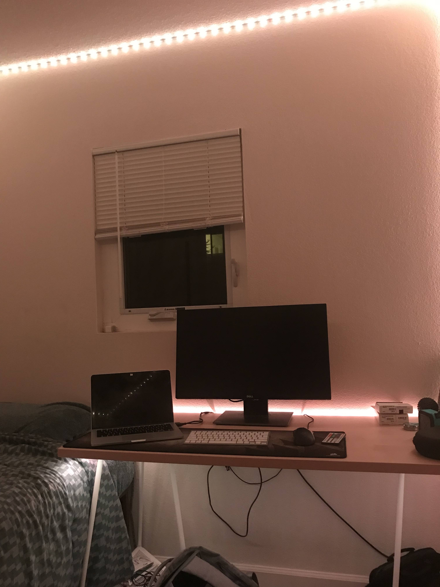
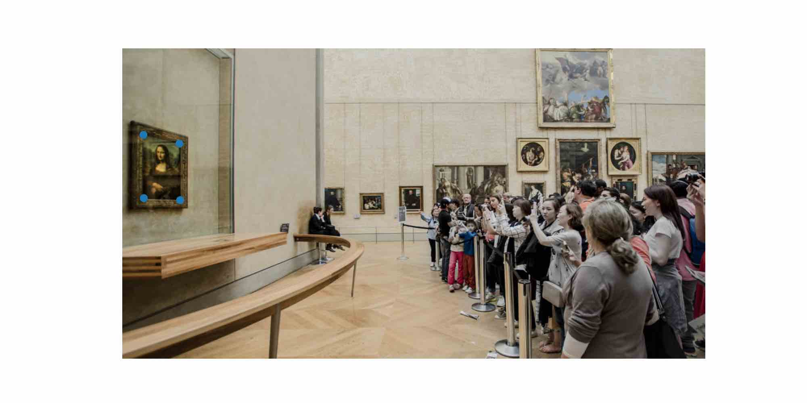
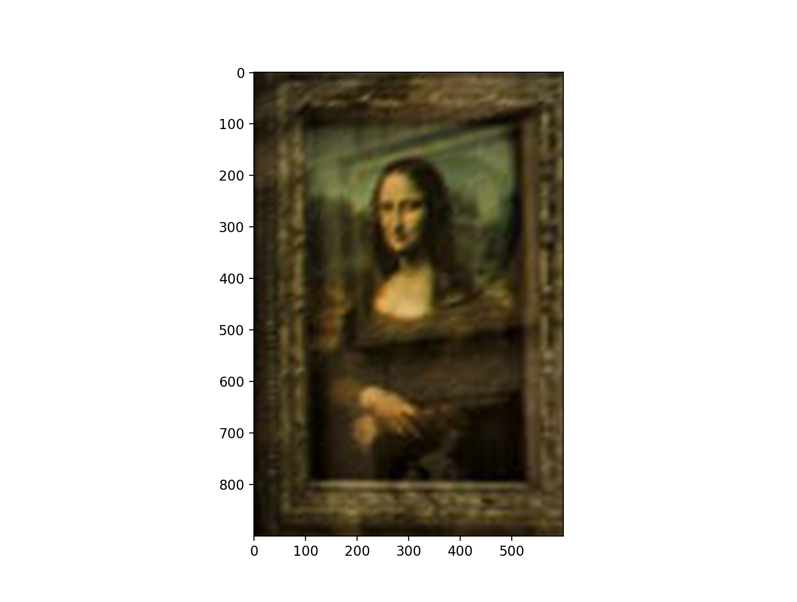
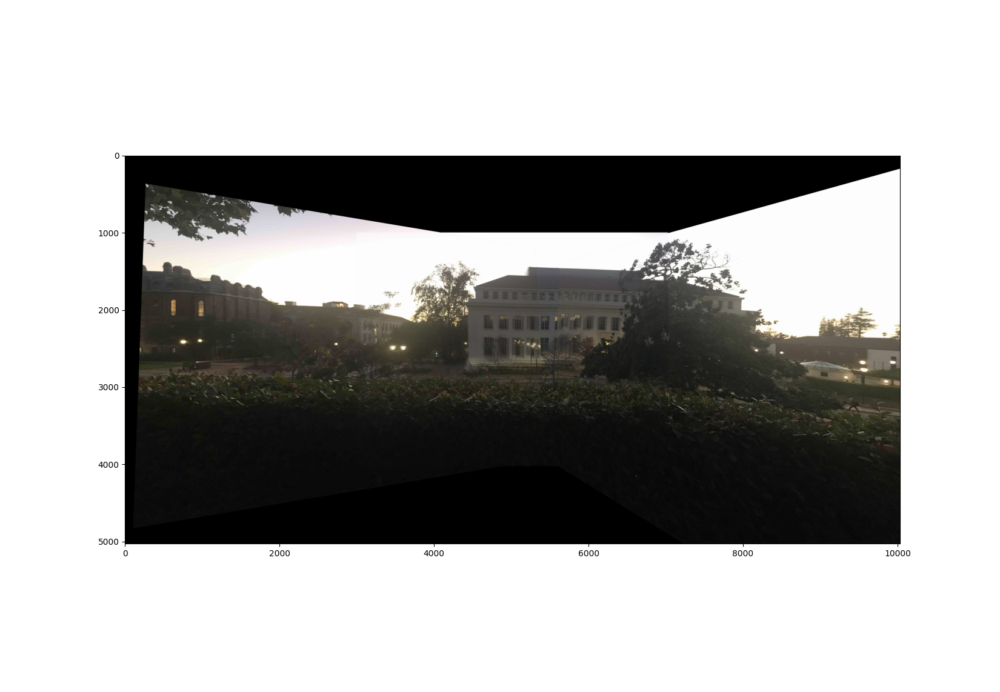
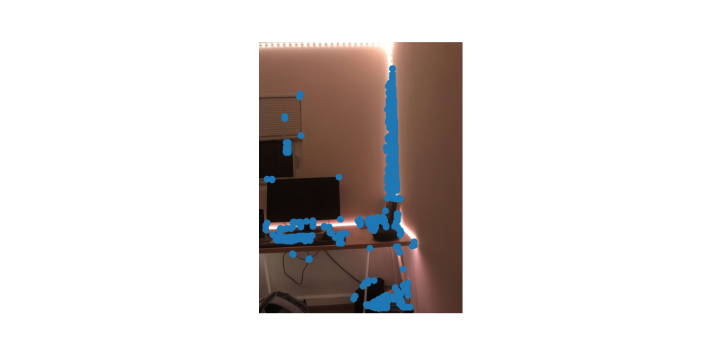

# Project 4(a)

Here, we are working with homographies: transforming images in a way that it appears to shift our perspective of an image. This can be done with a linear transformation. It obviously doesn't give new information as if the photo was taken from a different location, just making the photo look as if it was from a different angle.

**Shoot Photos**

Here are the 3 mosaic image sets that we will be working with here.

**Recover Homographies**

In order to define the homography transformation between one set of points and another, I used the method described in this article https://towardsdatascience.com/estimating-a-homography-matrix-522c70ec4b2c. If you take the the original formula for a homography

and actually multiply everything out, substituting the last equation z_a = h_31 + h_32 + h_33 for the z_a in the other two equations, you will end up getting 2 equations that are linearly independent. If you do this for each of your 4 points defined for the homography, you will have 8 equations for your 8 variables (setting h_33 to 1). The following is the system of equations you get in matrix form.

You can simply use least squares and roll up the values of h into a matrix (again, h_33 = 1). This transform isn't all you need though. Notice in the first equation that everything is scaled by z_a. In order to recover the x_i_hat and y_i_hat values themselves (which are the actual values that you care about), you need to divide every output vector you use this transform on by the z_a value given in the last entry of the output vector.

Here are some samples.
These first two images are original images.

Here is the second image warped to the perspective of the first.

You can see that it looks pretty convincing. The way in which we did this also should lead to an alignment of the images as well.

**Image Rectification**

Here is the results of going from a slanted view to a front view of the Mona Lisa.

Here is the input image. The second image has the keypoints.

Here is the output of transforming from the perspective of the side view to the front view of the mona lisa.

You can see that this looks pretty good. The view is nice, but unfortunately, due to the nature of the homography, the reflections in the glass don't get removed as if we were looking at it from head on. The same goes for the inner side of the frame. The right inside of the frame was visible from the side view, and we can still see it in the new view, but only the right side since the left side wasn't visible from our other view, hence the disorienting brown bar on the right side from the inner right side of the frame in our output view.

Here is another rectification of sather tower. This is a little jank since sather tower is small in this image, so my selected keypoints weren't perfect, but it should get the idea across and serve as further proof of concept of the rectification.

**Mosaic Creation**

Here, I just used the fact that my homography transform will also shift the image to be aligned with the keypoints in the starting frame to keep a running transform as I went down the list of images, starting with the identity and composing the next transform with this running transform and then transforming the next image with the current running transform. The output can be seen here. I also just averaged instead of feathering in the blended areas. The source images and result are shown below.

There are some issues with this. Clearly the transform isn't doing a perfect job. The homography itself looks fine, and it looks like the math is right because the perspective seems to shift, but there are just some image alignment issues that cause the middle areas to be a bit blurred. Below is the list of keypoints we defined for the first mosaic.

If you zoom in a lot, you can see that my keypoints aren't exactly aligned. I blame the matplotlib ginput which selects points that are offset down and to the right a few pixels from the tip of my mouse cursor... more towards the middle of the tip of my cursor. I also could have defined more points between the two images. That being said, half of the issue is that when taking the photos, I didn't leave enough room in between photos that would have allowed me to find more good keypoints and get a better transform.

Another issue that causes some weirdness is that I took this image at an off angle to the horizon. Instead of looking at images that are almost on the side of a cylinder, this mosaic is more like the top hemisphere in a dome. This is why the tower looks like it is at a weird angle: because it is so far from the first image (which we defined to be the center of the mosaic).

All that being said, without feathering or anything it does a good job. The homography itself is clearly still working and with better feature alignment and some real feathering and feature blur, this will only get better.

**Bells and Whistles**

Here is a fun image I did. I replaced the Mona Lisa with Nyan cat. Same keypoints as the mona lisa above. Enjoy

# Project 4(b)

**Harris Detector**

One of the problems that we need to solve is computing a set of features that will be in both image1 and image2. We will want to check all pairwise matchings between features in image1 and image2, seeing which subset of matching pairs forms a nice homography that is consistent across a large set of matching pairs. We generally like to detect corners, since if we just detected lines, features in image1 along that line could match with ANY of the features along the same line in image2. The harris detector is a corner detector that allows us to compute locations of windows.

The harris detector is a first order taylor series approximation of a more complex function that computes the "change in all directions" so to speak.

Here is a photo of locations of corners overlaying an image. The image has been modified so that it will be easier to see, but the base image was just the harris detector output thresholded at .01 * the max corner value

You can see that in places with high noise like the grass and roof tiles, the corner values are high. Darker places like the side of Doe library has fewer corners, although you can see where the roofing meets the sky and the ridges there have some good definition. Leaves on trees also have lots of corners and are colored accordingly. The multicolored shingles on the roofs have lots of high definition edges and are very bright. The sky with no edges is black.

**Adaptive Non-Max Suppression**

Now that we have corners, we need to find a way to select which corners are the best to use. We want corners which the harris detector thought were the strongest and most "corner" looking, but we also want to make sure that the corners we select to look at are well distributed throughout the image too. To do this, we use adaptive non-max suppression. In this, we consider each corner to have a "radius". The radius is the l1 distance to another corner of greater score by some set margin. Corners with large radii don't have any features near them that beat them in score. If we select corners in order of descending radius, we will select features that don't have other features nearby. This is what we want. The output of adaptive non-max suppression will be a set of fairly well distributed corners with fewer clusters to be found.

We now have a much smaller set of features that still captures all of the main corners in the image.

Here you can see the set of chosen corners is much more well distributed compared to the set of harris corners which are very much clustered around things like grass and roofs. That being said, the grass and roofs tend to have a higher point density, but the distribution is still pretty uniform over the image. I could stand to have some more points on the front of doe library, but there are still a few corners being selected on the dark front of the library that wouldn't be there had we just straight up thresholded for highest top scores.

**Feature Descriptor Extraction**

Now that we have the locations of the corners in each of 2 images, we need to find a good way to see how similar 2 corners look. To do this, we will simply look at the neighborhood of pixels around the corner, sampling around the corner with a stride so that our feature is smaller in size, making things easier to compute. Now we have a small set of pixels that describe a corner. We can simply flatten these out to get feature descriptors that we can compare to other features in other images with something like an ssd loss. The low frequency nature of this sampling makes this less sensitive to small changes induced by the homography that separates the two images.

These aren't rotation invariant, but it's still ok as our images aren't going to be crazy rotations or anything like that.

Here is one point of interest that was identified, the feature, and where it came from in the original image.

You can see that the feature descriptor resembles the original feature in shape. The brightest part of the actual ground truth pixels are brightest in the computed feature descriptor as well.

Here is another feature that came from one of the bottoms of the columns on the side of Doe.

**Feature Matching**

Here, what we want to do is simply find the features that look similar between two images. We can simply take the pairwise ssd loss for each pair of features between image1 and image2 since all features are of the same size. We can then say that for feature[i] in image1, the lowest ssd scoring feature[j] in image2 is the match. We will also track the second smallest score too. The reason for this, is that our reported score for the match of feature[i] in image1 and feature[j] in image2 won't be the best score, but the ratio of the best score to the second best score. This is Lowe's trick and it gives better separation of true matches and false matches. This is because we know that between the first two best scoring matches, one of them has to be false, and both of them can be false matches too. Despite the fact that different ssd losses for different pairs may be in different scales altogether given the severity of the homography and the size of the features themselves, if the first best and second best score similar, they're probably both wrong since one of them is for certain incorrect, and we can't discern between one that is definitively false and another that is possibly, but not certainly false.

We return the scores and matches for lowe's trick for every feature in image1. This doesn't take care of the issue of one feature in image2 matching to multiple features in image1, but when we compute the homography, so long as our error tolerance is low, any homography that tries to map multiple features in image1 to the same feature in image2 will fail and won't be selected as the best homography.

Here is the feature we just saw from the base of a column. This shouldn't have a match as you can see that all the bases of the columns in image1 are outside the overlap area, thus don't have any feature in image2, but it is still worth seeing how close the matches are, even for false matches. For reference, the lowe score for this feature was .805, well above the suggested values of from .25 to .5 (looking at the graphs in the paper's figure 7).

Here is its best feature match. You can see that this is pretty good. Clearly the feature matching is working.

Here is the next best thing after our top match.

You can see that we are starting to get worse matches.

Here is another feature that didn't even get close to matching.

Clearly the system is working.

Now we will look at a real match that is a feature shared between image1 and image2. It corresponds to one of the windows in physics building 1 right above the window into main stacks.

Here is the original image patch. The shadow just under the roof ledge is visible in the top half of the original image patch.

Here are the two matched features.

They are almost identical.

**RANSAC**

This is the meat of this project. Here, we are going to try and find a set of 4 feature pairs whose homography correctly maps (within a small error range epsilon) a bunch of other pairs as well that weren't used to compute the homography.

We take the set of all feature pairs that have a score lower than a threshold we set beforehand, and randomly choose 4 pairs, create a homography, and see how many other pairs agree with that homography. At the end, we take the largest agreeing set of points, and use those all to compute our final returned homography.

This was really difficult for me as small errors in any of the previous steps could be compunded here and would cause the returned homography to be bad. For example, if when computing the harris corners, we don't do any local nonmax suppression first before running the adaptive non-max suppression, we may get a few points that are one pixel away in image1 (within the error tolerance for RANSAC) and map to the same feature in image2. This is an issue because any homography (no matter how bad) that correctly maps one of those images will get agreement from its neighbors, skewing our metric unfairly, making it seem like there is much more agreement than there actually is for that homography. This was the primary reason for my homographies collapsing and forming unstable singularities where almost everything maps to a single point.

Here we can see that a homography that isn't trivial: lots of grass and repeated edges gets computed nicely. Running multiple trials showed that this is robust, holding up over many tries with very very low rates of failure, never failing so long as I kept running until getting a set of agreeing points of size at least 8.

This is the homography that we started computing by hand. Here it is generated automatically.

Here we can see some of the mosaics computed by RANSAC. If you look at the mosaic computed in part a), due to some issues with matplotlib's ginput not putting points in exactly the place of the tip of my cursor, we saw a lot of ghosting and artifacts from overlapping regions in the mosaic.... not here! Here, the homographies are very nice. Occasionally, I have observed some issues when we get unlucky and the set of agreeing points tend to lie fairly close to each other, giving a small patch in the overlapping area that looks very clean, but has ghosting towards the outer parts of the overlap where the pairs weren't located.

I will admit that the second auto generated image wasn't fantastic. There was some decent ghosting, but no tuning was done to get it, so I'll still take it. I also think that part of the issue was the presence of the hedge at the bottom. I think that the hedge created an issue due to that any homography... even a bad one... could get a sizeable group of inliers just from one coordinate on the hedge to another coordinate on the hedge.

The third image (depite how it looks) actually isn't doing a bad job. If you look, you will see that all the major objects (the desk, the light strip where it is in both images, the books, the monitor, etc) are all alligned pretty well. The problem is that in the upper region of the image, there isn't much in terms of edges to grab onto. The largest inliers group will correspond to the transformation that best transforms the regions with the most data.

Below is a slightly better result at lower res.

Here you can seee the unevenness in the distribution of keypoints. This isn't a fault of ANMS, but a fault of my white walls without edges, and the fact that we can't have edges near the border of the image, which might have allowed us to grab more from the lights at the top.

